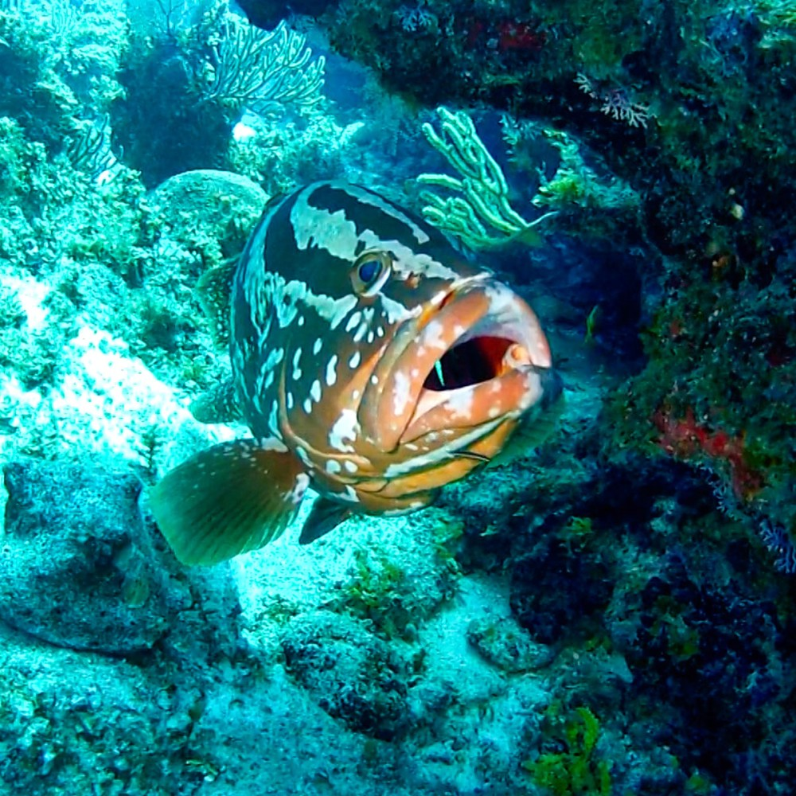

# Hidden Depths Drive: An Ocean of Secrets

## CTF Challenge Description

A crucial piece of information has been hidden in the depths of the attached image. Your mission is to recover the hidden flag through multiple layers of steganography and forensic analysis.

## Challenge Details
- **Difficulty**: Medium
- **Category**: Steganography, Forensics, Cryptography
- **Author**: Al Waleed Al Saleemi

## Getting Started

1. Download the challenge image: `challenge/challenge.png`
2. Examine the image thoroughly - not everything is visible to the naked eye
3. Remember that information can be hidden in many ways within a digital image

## Required Tools
- Image metadata analyzers (ExifTool)
- Steganography tools (Steghide)
- Basic hex decoder
- Python with image processing libraries (PIL/Pillow, NumPy)

## Submission
When you find the flag, submit it in the format `FLAG{...}`

## Hints
If you get stuck, check the [hints.md](hints.md) file for progressive hints that will guide you in the right direction without giving away the entire solution.

## Rules
1. Do not share the solution with others
2. Work through each layer methodically
3. The journey is as important as the destination

Good luck, diver! The depths await... ;)
